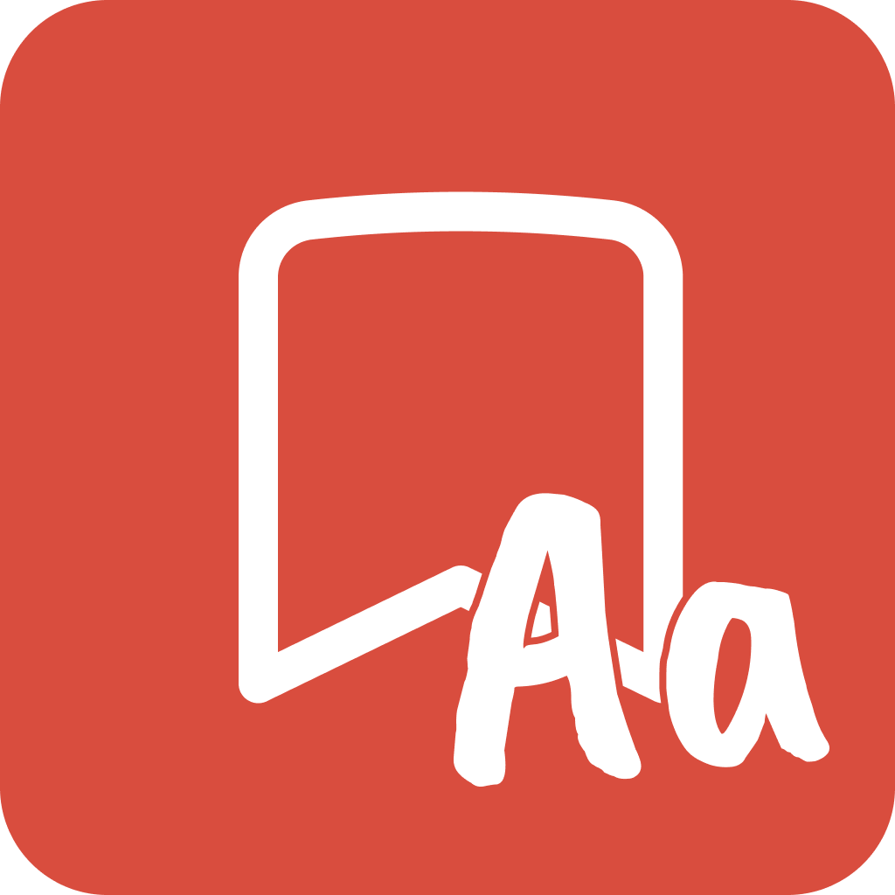

<a id="readme-top"></a>

<br />
<div align="center">
  <a href="https://github.com/Jemeni11/FontCache"></a>

<h3 align="center">FontCache</h3>

  <p align="center">
    Discover, collect, and save fonts effortlessly.
    <br />
    <a href="https://github.com/Jemeni11/FontCache"><strong>Explore the repo »</strong></a>
    <br />
  </p>
</div>

Table of Contents

- [Introduction](#introduction)
- [Features](#features)
- [Installation](#installation)
  - [From Browser Stores](#from-browser-stores)
  - [Local installation](#local-installation)
- [Usage](#usage)
- [Examples](#examples)
- [Why did I build this?](#why-did-i-build-this)
- [Contributing](#contributing)
- [Wait a minute, who are you?](#wait-a-minute-who-are-you)
- [License](#license)
- [Changelog](#changelog)

## Introduction

FontCache is your go-to browser extension for collecting and organizing fonts from any webpage. Easily discover fonts in use, pick your favorites, and save them with site and date details. With real-time previews and seamless organization, FontCache turns font inspiration into action, helping designers and developers stay productive and creative.

<p align="right">(<a href="#readme-top">back to top</a>)</p>

## Features

- **Discover Fonts**: Automatically list all fonts used on any webpage.
- **Select Favorites**: Pick and save fonts using a simple checkable list.
- **Track Sources**: Save fonts with site names and discovery dates.
- **Real-Time Previews**: See your saved fonts rendered in their actual styles.
- **Local Storage**: Securely store data using IndexedDB—fast and private.
- **No Extra Loading**: Use fonts already present on the page.


<p align="right">(<a href="#readme-top">back to top</a>)</p>

## Installation

### From Browser Stores

- Chrome Web Store
- Microsoft Edge
- Mozilla Firefox

### Local installation

> [!NOTE]
> 
> You may need Developer Mode enabled in your browser.

```sh
pnpm install
```

<p align="right">(<a href="#readme-top">back to top</a>)</p>

## Usage

```
usage: whoop di scoop
```

<p align="right">(<a href="#readme-top">back to top</a>)</p>

## Examples

wahhaaaaaa


<p align="right">(<a href="#readme-top">back to top</a>)</p>

## Why did I build this?

I love beautiful websites, and I believe one of the things that make them stunning is the fonts (and how they’re used). Whenever I came across a nice font, I’d open DevTools to find its name. This process was frustrating, so I installed an extension to make it easier. However, the extension I used only provided the font name. I couldn’t save the font name or the website it came from, so I ended up pasting everything into my notes. Later, when I wanted to use one of the fonts, I couldn’t even remember what it looked like. I also didn’t like switching back and forth between my browser and my notes app. So, I decided to build an extension that could do all of this for me.

<p align="right">(<a href="#readme-top">back to top</a>)</p>

## Contributing

Contributions are welcome! If you'd like to improve FontCache, please feel free to submit a pull request.

<p align="right">(<a href="#readme-top">back to top</a>)</p>

## Wait a minute, who are you?

Hello there! I'm Emmanuel Jemeni, and I am a Frontend Developer.

You can find me on various platforms:

- [LinkedIn](https://www.linkedin.com/in/emmanuel-jemeni)
- [GitHub](https://github.com/Jemeni11)
- [Twitter/X](https://twitter.com/Jemeni11_)
- [Bluesky](https://bsky.app/profile/jemeni11.bsky.social)

If you'd like, you can support me on [GitHub Sponsors](https://github.com/sponsors/Jemeni11/)
or [Buy Me A Coffee](https://www.buymeacoffee.com/jemeni11).

<p align="right">(<a href="#readme-top">back to top</a>)</p>

## License

[MIT License](LICENSE)

<p align="right">(<a href="#readme-top">back to top</a>)</p>


## Changelog
[Changelog](/CHANGELOG.md)

<p align="right">(<a href="#readme-top">back to top</a>)</p>
